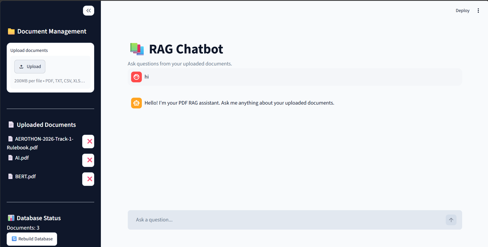
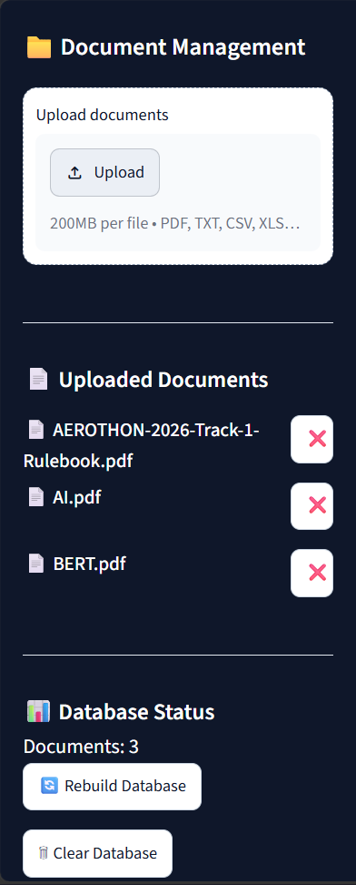
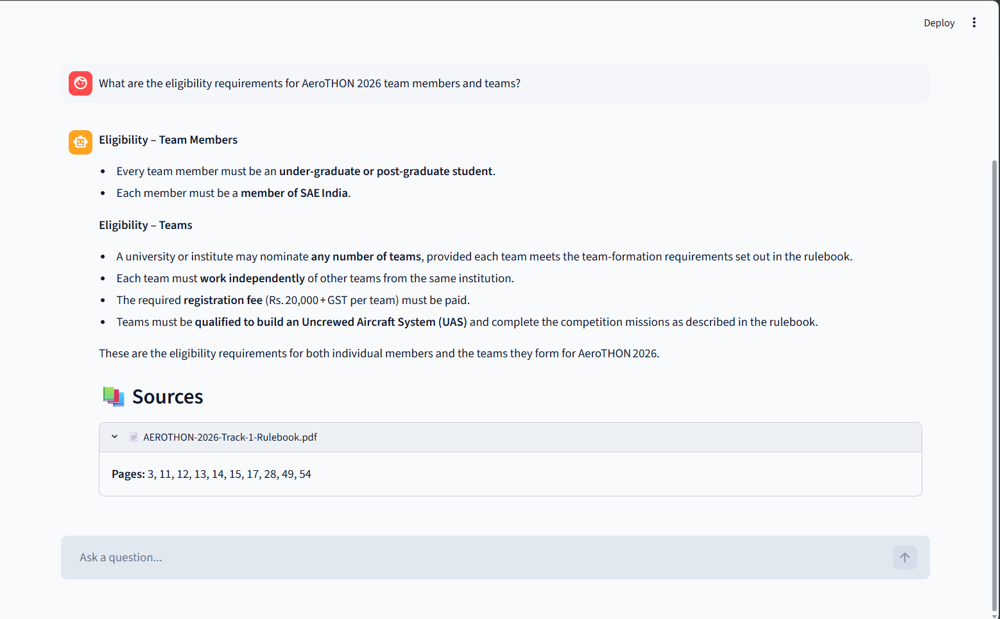
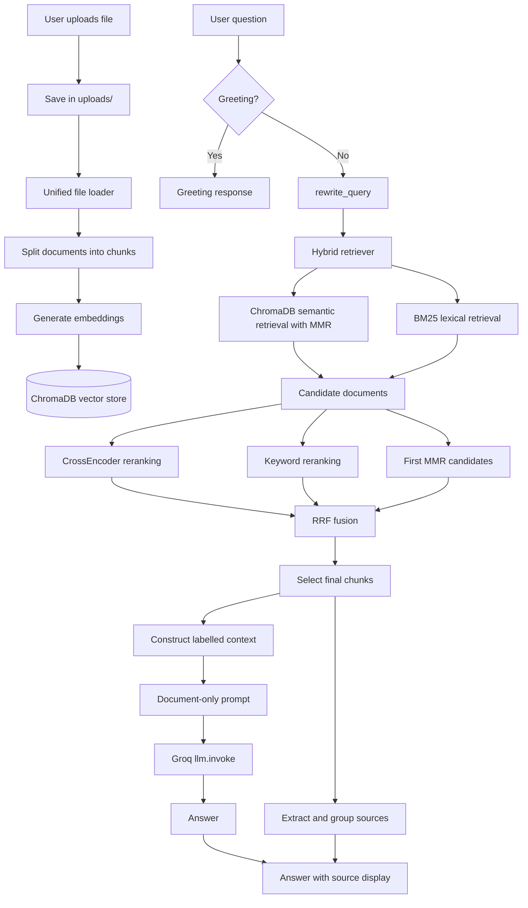

# 📚 RAG Chatbot

A Streamlit chatbot for uploading documents and asking questions about their contents. The application retrieves relevant chunks, ranks them, and generates an answer from the retrieved context through Groq.


## 📸 Screenshots

### Chatbot Interface



### Document Management



### Source Attribution



## Features

- Upload PDF, TXT, CSV, XLS, XLSX, DOCX, and PPTX documents.
- Load files through one unified loader and preserve available metadata.
- Split documents into overlapping chunks and index them in ChromaDB.
- Combine ChromaDB semantic retrieval with MMR and BM25 lexical retrieval.
- Apply CrossEncoder and keyword-based relevance ranking.
- Fuse ranking signals with Reciprocal Rank Fusion (RRF).
- Rewrite follow-up questions using conversation history when needed.
- Generate document-grounded answers with an explicit abstention response.
- Display grouped source filenames and available one-based page numbers.
- Upload, delete, rebuild, and clear the local document index from the UI.
- Run saved RAG tests and RAGAS evaluation scripts.

## Supported File Formats

| Extension | Loader | Page metadata |
| --- | --- | --- |
| PDF | `PyPDFLoader` | Usually available |
| TXT | `TextLoader` | May be unavailable |
| CSV | `CSVLoader` | May be unavailable |
| XLS, XLSX | `UnstructuredExcelLoader` | May be unavailable |
| DOCX | `Docx2txtLoader` | May be unavailable |
| PPTX | `UnstructuredPowerPointLoader` | May be unavailable |

The loader is implemented in `loaders/file_loader.py`. A page number is not guaranteed for every format; for example, CSV records may have `page=None`.

## RAG Architecture



## Document Processing and Indexing

1. A user uploads a supported file through the Streamlit sidebar.
2. The file is saved in `uploads/` and passed to the unified loader.
3. The loader selects the appropriate LangChain document loader and adds a `file_type` metadata value.
4. `preprocess/splitter.py` uses a recursive splitter with 500-character chunks and 100-character overlap.
5. Each chunk retains available metadata such as `source`, `page`, `page_label`, `file_type`, and a generated `chunk_id`.
6. Hugging Face embeddings are generated and the chunks are stored in ChromaDB.

The application can append newly uploaded files, delete a file and its vectors, rebuild the database from all files in `uploads/`, or clear the local ChromaDB directory.

## Question and Query Flow

Non-greeting questions are passed to `ask_question()` in `rag/rag_chain.py`. With no chat history, `rewrite_query()` returns the trimmed original question. When history exists, the LLM rewrites a dependent follow-up into a standalone retrieval query when necessary. Clear standalone questions remain unchanged. The rewrite prompt must only rewrite the question and must not answer or invent information.

## Hybrid Retrieval

The active hybrid retriever combines two complementary search methods:

- **Semantic retrieval:** ChromaDB searches embedded chunks using MMR with `k=50`, `fetch_k=100`, and `lambda_mult=0.70`.
- **Lexical retrieval:** BM25 is built from the currently loaded and split documents, with `k=50`.

The ensemble weights semantic retrieval at `0.45` and BM25 at `0.55`. Semantic retrieval handles conceptual similarity, while BM25 helps find exact words, names, identifiers, and terminology.

## Ranking and Context Construction

After hybrid retrieval, the application applies the following ranking stages:

1. The CrossEncoder scores query-document relevance and selects candidates while preserving page diversity where page metadata exists.
2. The keyword reranker scores the overlap between query terms and document terms.
3. The first eight hybrid results are retained as MMR candidates.
4. RRF combines the CrossEncoder, keyword, and MMR result lists using rank positions.
5. The first twelve fused documents are formatted into the final context with source and page labels.

The repository also contains a `remove_duplicate_documents()` helper, and the saved RAG test path removes duplicate chunk text when preparing evaluation contexts. The live `ask_question()` path uses RRF document IDs and does not call that helper separately.

## Answer Generation

The active provider is Groq through `ChatGroq`. The model name is configured in `config.py`, and the API key is read from the `GROQ_API_KEY` environment variable. The final answer is generated with `llm.invoke(messages)`; the active application path is not streaming.

The prompt instructs the model to use only the supplied context, avoid outside knowledge, and avoid inventing or assuming information. If the retrieved context is insufficient, the required response is exactly:

> I don't know based on the provided documents.

## Source Attribution

The application extracts source filenames and page values from the final selected chunks. Page metadata is converted from zero-based values to user-friendly one-based page numbers when available. `group_sources()` groups pages by filename for display in expandable Streamlit source sections. Files without page metadata are shown without a page number.

## Tech Stack

| Area | Technologies |
| --- | --- |
| Language and UI | Python, Streamlit |
| RAG framework | LangChain |
| Document loading | PyPDF, Unstructured, python-docx, openpyxl, python-pptx, xlrd |
| Embeddings | Hugging Face embeddings, Sentence Transformers |
| Retrieval | ChromaDB, MMR, BM25 |
| Reranking | Sentence Transformers CrossEncoder, keyword reranking, RRF |
| LLM | Groq through `langchain-groq` |
| Evaluation | RAGAS and repository evaluation scripts |

## Project Structure

```text
rag-chatbot/
├── .env.example
├── .gitignore
├── .streamlit/
│   └── config.toml
├── README.md
├── app.py
├── config.py
├── index.py
├── requirements.txt
├── test_ollama.py
├── test_ragas_ollama.py
├── embeddings/
│   └── embedding_model.py
├── evaluation/
│   ├── evaluation_results.json
│   ├── ragas_evaluation.py
│   ├── run_evaluation.py
│   ├── run_rag_test.py
│   └── test_questions.py
├── llm/
│   └── llm.py
├── loaders/
│   ├── file_loader.py
│   └── pdf_loader.py
├── preprocess/
│   └── splitter.py
├── rag/
│   └── rag_chain.py
├── retriever/
│   ├── hybrid_retriever.py
│   ├── keyword_reranker.py
│   └── reranker.py
├── utils/
│   ├── __init__.py
│   ├── file_manager.py
│   ├── greetings.py
│   └── source_utils.py
└── vectordb/
    ├── chroma_db.py
    └── delete_documents.py
```

The local `uploads/` and `chroma_db/` directories are runtime data locations and should remain untracked.

## Installation

Run the following commands in Windows PowerShell:

```powershell
git clone https://github.com/Jayasurya-C-0609/Rag_Chatbot.git
cd Rag_Chatbot
python -m venv .venv
.\.venv\Scripts\Activate.ps1
pip install -r requirements.txt
New-Item -Path .env -ItemType File -Force
notepad .env
```

Add the required credential to `.env`:

```dotenv
GROQ_API_KEY=your_groq_api_key
```

Install the spaCy English language model:

```powershell
python -m spacy download en_core_web_sm

Start the application:

```powershell
streamlit run app.py
```

The first run may download embedding and CrossEncoder models from Hugging Face.

## Environment Variables

| Variable | Purpose | Required |
| --- | --- | --- |
| `GROQ_API_KEY` | Authenticates the active Groq LLM and the Groq smoke test | Yes for the application |

## Usage

1. Start the Streamlit application.
2. Upload one or more supported files.
3. Wait while the files are loaded, split, embedded, and indexed.
4. Ask questions about the uploaded documents.
5. Review the generated answer.
6. Expand the source sections to review filenames and available pages.
7. Use the sidebar controls to delete files, rebuild the index, or clear ChromaDB when needed.

## Evaluation

The repository includes `evaluation/test_questions.py`, saved results in `evaluation/evaluation_results.json`, a RAG test runner, custom evaluation code, and a RAGAS evaluation script. RAGAS evaluates context precision, context recall, faithfulness, answer relevance, and answer correctness, while the scripts also assess abstention behavior.

The RAGAS path uses an Ollama-compatible local endpoint for its evaluation LLM and writes results to `evaluation/ragas_results.json`. Evaluation commands make model calls and require the relevant local or remote services. No benchmark scores are claimed here.

## Security

Never commit `.env`, API keys, tokens, passwords, uploaded documents, ChromaDB data, model caches, virtual environments, `__pycache__/`, or generated logs. `.env` is ignored by Git; use `.env.example` only as a placeholder template. No credentials should be hardcoded in the repository.

## Limitations

- Retrieval quality depends on document extraction, chunking, embeddings, and ranking settings.
- Answers depend on the context retrieved for each question.
- Some supported formats may not provide page metadata.
- The active Groq provider requires external API access and a valid API key.
- RAGAS evaluation requires its configured local evaluation service and model.

## Future Improvements

- Tune hybrid retrieval, reranking, and RRF settings.
- Improve document and metadata filtering.
- Expand evaluation coverage and regression testing.
- Improve the Streamlit UI and interaction flow.
- Add deployment support and clearer provider configuration.
- Extend processing for complex document layouts and tables.

## Author

**Jayasurya C**

GitHub: [Jayasurya-C-0609/Rag_Chatbot](https://github.com/Jayasurya-C-0609/Rag_Chatbot)