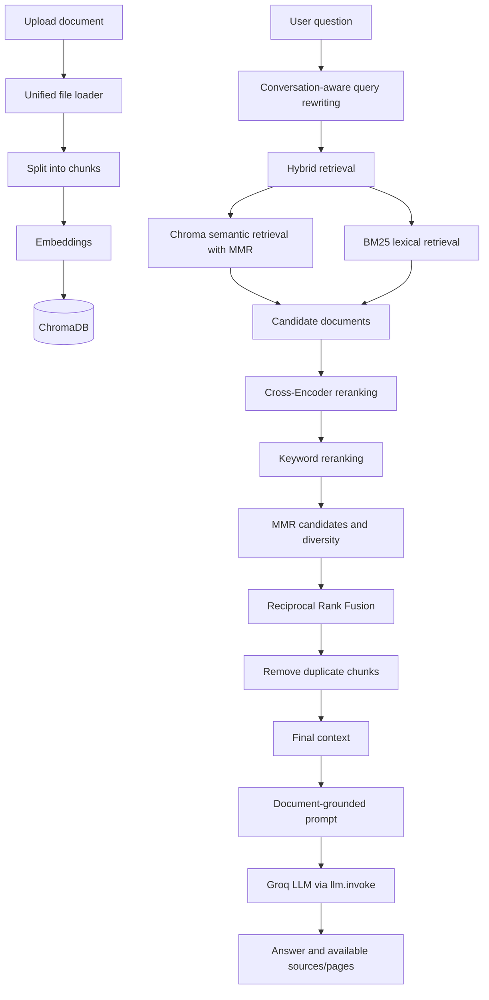

# 📚 RAG Chatbot

A Streamlit chatbot that lets users upload documents and ask questions about their contents. It uses Retrieval-Augmented Generation to retrieve, rank, and cite relevant document chunks before generating an answer.

## Features

- Upload PDF, TXT, CSV, XLS, XLSX, DOCX, and PPTX files.
- Index uploaded files into a persistent ChromaDB vector store.
- Combine semantic and lexical retrieval for stronger search coverage.
- Rerank results with a Cross-Encoder and keyword matching.
- Preserve diverse candidates with Maximal Marginal Relevance (MMR).
- Rewrite follow-up questions using conversation history when needed.
- Generate answers constrained to retrieved document context.
- Display source filenames and available page numbers.
- Add files, delete files, rebuild the index, and manage uploaded documents from the UI.
- Evaluate retrieval and answer quality with custom evaluation code and RAGAS support.

## Supported File Formats

| Extension | Loader | Page metadata |
| --- | --- | --- |
| PDF | `PyPDFLoader` | Usually available |
| TXT | `TextLoader` | May be unavailable |
| CSV | `CSVLoader` | May be unavailable |
| XLS, XLSX | `UnstructuredExcelLoader` | May be unavailable |
| DOCX | `Docx2txtLoader` | May be unavailable |
| PPTX | `UnstructuredPowerPointLoader` | May be unavailable |

Page numbers depend on the source loader. Source filenames are displayed when available, and documents without page metadata may show no page number.

## RAG Architecture



### Processing and Indexing

The unified loader in `loaders/file_loader.py` selects a format-specific LangChain loader. Documents are split by the project splitter into 500-character chunks with 100-character overlap. Available metadata, including source, page, file type, and generated chunk ID, is preserved on each chunk. Embeddings are stored in ChromaDB for semantic retrieval.

### Question Flow

The question is rewritten into a standalone retrieval query when conversation history is needed. The query then passes through hybrid retrieval, ranking, fusion, duplicate removal, context construction, and answer generation. This separates search-oriented query preparation from the final response prompt.

## How Retrieval Works

The active retriever combines:

1. **Semantic retrieval:** ChromaDB uses embedding similarity with MMR. MMR balances relevance with diversity among the selected chunks.
2. **BM25 retrieval:** BM25 searches the currently loaded and split documents using lexical term matching.
3. **Candidate ranking:** A Cross-Encoder scores semantic relevance, while keyword reranking preserves exact terminology and matches.
4. **Fusion:** RRF combines the Cross-Encoder, keyword, and MMR ranking signals. Chunks are identified and duplicates are removed before the final context is built.

Hybrid retrieval is useful because semantic search handles conceptual similarity, BM25 helps with exact keywords, Cross-Encoder reranking improves ordering, keyword reranking protects important terminology, MMR maintains variety, and RRF combines these complementary signals.

## Question Rewriting

The `rewrite_query()` function returns the original question unchanged when there is no chat history. With history, the LLM rewrites follow-up questions into standalone retrieval questions when necessary. Questions that are already clear and standalone should remain unchanged.

The rewrite prompt preserves the original meaning, uses history only when relevant, and instructs the LLM to return only a rewritten question. It must not answer the question or invent information.

## Answer Generation

The active LLM provider is Groq, configured through `ChatGroq`. The final response is generated with `llm.invoke(messages)`, so the active answer path is not described as streaming.

The answer prompt instructs the model to use only the retrieved context, ignore outside knowledge, and avoid inventing or assuming information. When the context does not contain enough information, the exact fallback response is:

> I don't know based on the provided documents.

## Source Attribution

Retrieved chunks retain source metadata. The application extracts source filenames and page values from the final selected documents and presents them with the answer. Page values are converted from zero-based metadata to user-friendly one-based page numbers when page metadata exists. Formats such as CSV may have `page=None`, so a page number is not guaranteed for every file.

## Tech Stack

| Area | Technologies |
| --- | --- |
| Language and UI | Python, Streamlit |
| RAG framework | LangChain |
| Document loading | PyPDF, PyMuPDF, Unstructured, python-docx, openpyxl, python-pptx, xlrd |
| Embeddings | Hugging Face embeddings, Sentence Transformers |
| Retrieval | ChromaDB with MMR, BM25 |
| Reranking | Sentence Transformers Cross-Encoder, keyword reranking, RRF |
| LLM | Groq through `langchain-groq` |
| Evaluation | RAGAS and custom evaluation code |

## Project Structure

```text
rag-chatbot/
├── app.py
├── config.py
├── index.py
├── Modelfile
├── requirements.txt
├── test_ollama.py
├── test_ragas_ollama.py
├── embeddings/
│   └── embedding_model.py
├── evaluation/
│   ├── error_analysis.py
│   ├── evaluation_results.json
│   ├── evaluator.py
│   ├── ragas_evaluation.py
│   ├── retrieval_debug.py
│   ├── run_evaluation.py
│   ├── run_rag_test.py
│   └── test_questions.py
├── llm/
│   └── llm.py
├── loaders/
│   ├── file_loader.py
│   └── pdf_loader.py
├── preprocess/
│   └── splitter.py
├── rag/
│   └── rag_chain.py
├── retriever/
│   ├── hybrid_retriever.py
│   ├── keyword_reranker.py
│   ├── reranker.py
│   └── retriever.py
├── utils/
│   ├── __init__.py
│   ├── file_manager.py
│   ├── greetings.py
│   └── source_utils.py
└── vectordb/
    ├── chroma_db.py
    └── delete_documents.py
```

`uploads/` and `chroma_db/` are runtime directories used for uploaded documents and generated vector data. They are present locally but should remain untracked.

## Installation

Run these commands in Windows PowerShell:

```powershell
git clone https://github.com/Jayasurya-C-0609/Rag_Chatbot.git
cd Rag_Chatbot
python -m venv .venv
.\.venv\Scripts\Activate.ps1
pip install -r requirements.txt
New-Item -Path .env -ItemType File -Force
notepad .env
```

Add the required Groq credential to `.env` using a placeholder during setup:

```dotenv
GROQ_API_KEY=your_groq_api_key
```

Then start the application:

```powershell
streamlit run app.py
```

The first run may download embedding and reranking models from Hugging Face.

## Environment Variables

| Variable | Purpose | Required |
| --- | --- | --- |
| `GROQ_API_KEY` | Authenticates the active Groq LLM | Yes |

## Usage

1. Start the Streamlit application.
2. Upload one or more supported documents from the sidebar.
3. Wait while each document is loaded, split, embedded, and indexed.
4. Ask a question about the uploaded content.
5. Review the document-grounded answer.
6. Review the source filenames and page numbers when available.

## Evaluation

The repository includes a test question set, saved evaluation results, custom evaluation functions, and a RAGAS evaluation script. Available evaluation code covers retrieval behavior and answer quality, including context precision, context recall, faithfulness, answer relevance, answer correctness, and abstention behavior. Evaluation support is intended for development and comparison; this README does not claim benchmark scores.

## .gitignore / Security

Do not commit `.env` files, API keys, uploaded documents, ChromaDB files, model caches, virtual environments, `__pycache__` directories, or other secrets. The repository `.gitignore` contains rules for these local and generated artifacts.

## Limitations

- Retrieval quality depends on document extraction, chunking, embeddings, and ranking settings.
- Answers depend on the context retrieved for the question.
- Some file formats may not provide page metadata.
- External LLM/API access is required for the active Groq provider.

## Future Improvements

- Tune hybrid retrieval, reranking, and chunking settings.
- Add more precise document and metadata filtering.
- Expand evaluation and regression testing.
- Improve the Streamlit UI and interaction flow.
- Add deployment support and clearer provider configuration.
- Extend document processing for complex layouts and tables.

## Author

**Jayasurya C**

GitHub: [Jayasurya-C-0609/Rag_Chatbot](https://github.com/Jayasurya-C-0609/Rag_Chatbot)